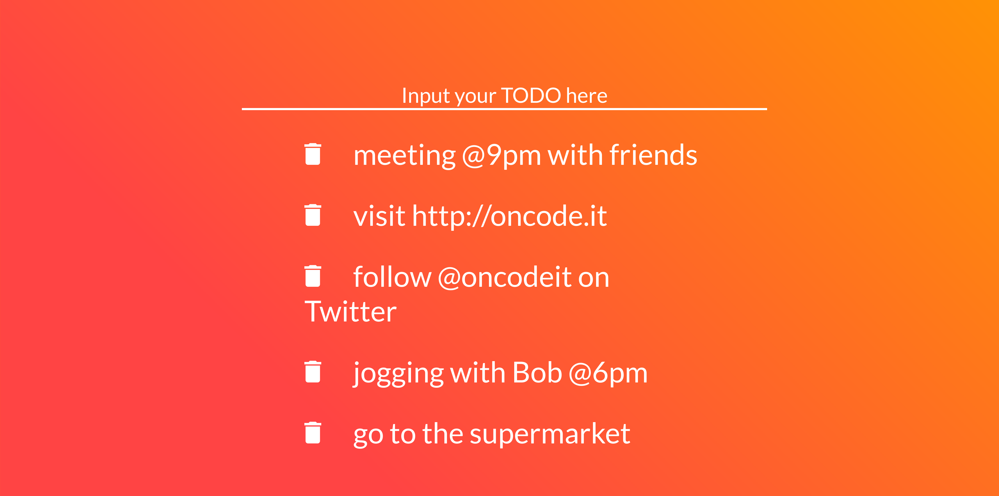

# VueTodoApp

Yet another Vue.js TODO application. For learning reasons this time. This demo comes useful when teaching the basics on Vue.js frontend development.
Feel free to use it as a first step inside Vue.js.

In the future, more feature could be added as the presence of a backend: creating an account for saving the TODOs and share them on the social networks.

# Running the demo
Getting started is very simple with this demo. Clone the repo, and open index.html.
Vue.js is fetched using the CDN, so you don't have to install any additional packages.

If you can't wait and you want to have a look at it live, please go and see this pen: https://codepen.io/oncode/pen/RVVLRJ

Please note that is is also desktop and mobile friendly! :)

Cheers,
the oncode team.
